# Rest-API-UI-Dashboard

# Crime Data API and Visualization Dashboard

## Table of Contents
- [Overview](#overview)
- [Csv to Mysql](#csv-to-mysql)
    - [Data Sources](#data-sources)
    - [ETL Process](#etl-process)
    - [Data Schema](#data-schema)
- [Crime Data API](#crime-data-api)
    - [Features](#features)
    - [Technologies Used](#technologies-used)
    - [Setup and Installation](#setup-and-installation)
    - [API Endpoints](#api-endpoints)
- [UI Visualization Dashboard](#ui-visualization-dashboard)
    - [Usage](#usage)
    - [Visual Features](#visual-features)
- [Conclusion](#conclusion)
- [Future Enhancements](#future-enhancements)
- [Acknowledgements](#acknowledgements)
- [Contact](#contact)

## Overview

This project involves creating a REST API to analyze crime data from U.S. cities, including Chicago, San Franscisco and Seattle, coupled with a visualization dashboard. The project is divided into three main components:

1. **Data Ingestion**: Importing crime data from CSV files into a MySQL database.
2. **API Development**: Building a Flask-based API to query and analyze crime data.
3. **Visualization Dashboard**: A web application to visualize crime trends using interactive charts.

### Summary

This project involves creating a REST API to analyze crime data from multiple cities, sourced from their respective government websites. The project includes data cleaning, classification, and storage in a MySQL database. The API enables users to query crime statistics, categorized into various crime types, for specific cities and time ranges.

### Initial Question

How can we create a unified interface to analyze and compare crime trends across major cities in the U.S.?

<br>

# Csv to Mysql

## Data Sources
- **Chicago Crime Data**: Downloaded as `ChicagoCrimes.csv`. From [Chicago Data Portal](https://data.cityofchicago.org/Public-Safety/Crimes-2001-to-Present/ijzp-q8t2/about_data)
- **San Francisco Crime Data**: Downloaded as `SanFranciscoCrimes.csv`. From [Data SF](https://data.sfgov.org/Public-Safety/Police-Department-Incident-Reports-2018-to-Present/wg3w-h783/about_data)
- **Seattle Crime Data**: Downloaded as `SeattleCrimes.csv`. From [SPD Crime Data](https://data.seattle.gov/Public-Safety/SPD-Crime-Data-2008-Present/tazs-3rd5/about_data)

## Combining the Data
- Data from all three cities were cleaned and standardized into a common schema ```joint by date.```
- Crime data were categorized into major crime categories for better analysis.
- Data were loaded into a MySQL database for efficient querying.

## ETL Process
1. **Extract**: Downloaded CSV files from city websites.
2. **Transform**:
   - Cleaned and standardized column names.
   - Mapped specific city-specific categories to a unified schema.
   - Categorized crimes into broader categories.
   - Filtered data for records from 2019 onwards and removed incomplete records.
3. **Load**: Inserted cleaned data into a MySQL table (`hovetl_crimes`).
```python
def create_crimes_table(cursor):
    cursor.execute("DROP TABLE IF EXISTS hovetl_crimes")
    create_table_query = """
        CREATE TABLE IF NOT EXISTS hovetl_crimes (
            CID INT PRIMARY KEY AUTO_INCREMENT,
            CrimeDate DATETIME,
            DateYear INT,
            DateMonth INT,
            City VARCHAR(100),
            Crime_Category VARCHAR(100),
            Sub_Category VARCHAR(100),
            Crime_Description VARCHAR(100),
            Latitude FLOAT,
            Longitude FLOAT
        ) ENGINE=MyISAM DEFAULT CHARSET=latin1 AUTO_INCREMENT=1 ;
    """
    cursor.execute(create_table_query)
    print("Crimes table created.")
```

```python
def insert_data_to_mysql(cursor, dataframe, table_name="hovetl_crimes"):

    insert_query = f"""
        INSERT INTO {table_name} ( 	
            Latitude, Longitude, Crime_Description,	Sub_Category,	
            City, CrimeDate, DateYear, DateMonth, Crime_Category
        ) VALUES (%s, %s, %s, %s, %s, %s, %s, %s, %s)
    """

    data_tuples = dataframe.to_records(index=False).tolist()
    
    try:
        cursor.executemany(insert_query, data_tuples)
        print(f"Successfully inserted {len(data_tuples)} records into {table_name}.")
    except Exception as e:
        print(f"Error inserting data: {e}")
```
```python
def main():
    create_crimes_table(cur)

    insert_data_to_mysql(cur, crime_data)

    cur.close()
    conn.close()
```
```python
if __name__ == "__main__":
    main()
```

## Data Schema
The `hovetl_crimes` table in MySQL uses the following schema:

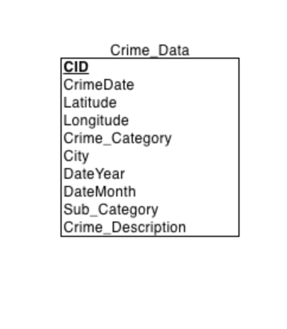

- **CID**: Auto-incremented primary key.
- **CrimeDate**: Datetime of the crime.
- **DateYear**: Year extracted from `CrimeDate`.
- **DateMonth**: Month extracted from `CrimeDate`.
- **City**: City where the crime occurred.
- **Crime_Category**: Categorized crime type.
- **Sub_Category**: Specific subcategory of the crime.
- **Crime_Description**: Detailed description of the crime.
- **Latitude and Longitude**: Geolocation data.

<br>

# Crime Data API

This is a Flask-based API designed to provide insights into crime data stored in a MySQL database (`hovetl_crimes`). The API enables users to retrieve and analyze crime statistics based on specific queries such as trends over time, city comparisons, and detailed category-based summaries.


## Features
- Secure API key-based access to endpoints.
- Query trends in crimes over time or by city.
- Retrieve statistics grouped by crime categories.
- Easy integration with external systems.
- Lightweight and fast for scalable usage.

## Technologies Used
- **Python 3.8+**: Core programming language for the API.
- **Flask**: Web framework for building and routing the API.
- **MySQL**: Database for storing and querying crime data.
- **MySQL-Python Connector**: Interface for connecting the Flask app to the MySQL database.

## Setup and Installation

### Prerequisites
1. **Python**: Ensure Python 3.8 or later is installed.
2. **MySQL Database**: Install and configure a MySQL database. The schema `hovetl_crimes` should include relevant crime data.


### Installation Steps

1. Clone the repository


2. Set up Database Credentials:

   Follow the structure in config.example.yml file
   ```python
   db:
      host: 'your-host-name'
      user: 'your-user-name'
      passwd: 'your-password'
      db: 'your-database-name'
      port: port-number
   ```
   Then rename the file to config.yml

3. Run the application:
   ```bash
   python app.py
   ```

4. Access the API at

   ```arduino
   http://127.0.0.1:5000
   ``` 

## API Endpoints

### API Key Validation
All endpoints require an API key for access. Add the key as a query parameter: `?key=123`.

Example:
```
http://127.0.0.1:5000/crime_over_years?key=123
```

### Crime Category Per City
Retrieve crime category per city.
- **Method**: GET
- **Endpoint**: `/crime_category_per_city`
- **Parameters**:
  - `key` (required): API key for authentication.

**Response Example**:
```json
[
   {
      "City": "Chicago",
      "Crime_Category": "Burglary",
      "Crime_Count": 10104
   }
]
```

### Crime Over Years
Retrieve crime trends over the years.
- **Method**: GET
- **Endpoint**: `/crime_over_years`
- **Parameters**:
  - `key` (required): API key for authentication.

**Response Example**:
```json
[
    {
      "Crime_Count": 207706,
      "DateYear": 2019
    },
    {
      "Crime_Count": 186312,
      "DateYear": 2020
    }
]
```

### Crime Per Month  
Retrieve crime trends by month for a specific city.  

- **Method**: GET  
- **Endpoint**: `/crime_per_month`  
- **Parameters**:  
  - `key` (required): API key for authentication.  
  - `city` (required): The name of the city for which to retrieve crime data.  

**Response Example**:  
```json
[
   {
      "Crime_Count": 29129,
      "DateMonth": 1
    },
    {
      "Crime_Count": 22136,
      "DateMonth": 12
    }
]
```

### Crime By Date Range  
Retrieve crime data within a specific date range.  

- **Method**: GET  
- **Endpoint**: `/crime_by_date_range`  
- **Parameters**:  
  - `key` (required): API key for authentication.  
  - `start_date` (required): Start date for the range in `YYYY-MM-DD` format.  
  - `end_date` (required): End date for the range in `YYYY-MM-DD` format.  

**Response Example**:  
```json
[
   {
      "CrimeDate": "Wed, 01 Jan 2020 00:00:00 GMT",
      "Crime_Count": 739
   },
   {
      "CrimeDate": "Thu, 02 Jan 2020 00:00:00 GMT",
      "Crime_Count": 595
   }
]
```

### Crime Comparison Per Year
Retrieve crime trends comparing different years.

- **Method**: GET
- **Endpoint**: `/crime_comparison_per_year`
- **Parameters**:
  - `key` (required): API key for authentication.

**Response Example**:
```json
[
    {
      "City": "Chicago",
      "Crime_Category": "Burglary",
      "Crime_Count": 15,
      "DateYear": 2019
    },
]
```

### Crime Statistics By Category
Retrieve crime statistics categorized by type for a specific period.

- **Method**: GET
- **Endpoint**: `/crime_statistics_by_category`
- **Parameters**:
  - `key` (required): API key for authentication.

**Response Example**:
```json
[
   {
      "Crime_Category": "Burglary",
      "Crime_Count": 94501
   },
   {
      "Crime_Category": "Crimes Against Government",
      "Crime_Count": 24149
   }
]
```

### Crime By Day of Week
Retrieve crime statistics categorized by day of the week.

- **Method**: GET
- **Endpoint**: `/crime_by_day_of_week`
- **Parameters**:
  - `key` (required): API key for authentication.

**Response Example**:
```json
[
    {
      "Crime_Count": 179876,
      "Day_Of_Week": 1
    },
    {
      "Crime_Count": 195758,
      "Day_Of_Week": 2
    }
]
```

### Crime Details By City and Category
Retrieve detailed crime statistics for a specific city and crime category.

- **Method**: GET
- **Endpoint**: `/crime_details_by_city_category`
- **Parameters**:
  - `key` (required): API key for authentication.
  - `city` (required): Name of the city (e.g., "Seattle").
  - `category` (required): The crime category (e.g., "Theft").

**Response Example**:
```json
[
    {
      "Crime_Count": 25474,
      "Sub_Category": "MOTOR VEHICLE THEFT"
    },
    {
      "Crime_Count": 22288,
      "Sub_Category": "FRAUD OFFENSES"
    }
]
```
### Crime Location Density By City
Retrieve crime density statistics by location for a specific city.

- **Method**: GET
- **Endpoint**: `/crime_location_density_by_city`
- **Parameters**:
  - `key` (required): API key for authentication.
  - `city` (required): Name of the city (e.g., "Chicago").

**Response Example**:
```json
[
   {
      "Latitude": 41.9178,
      "Longitude": -87.756
    },
    {
      "Latitude": 41.9952,
      "Longitude": -87.7134
    }
]
```

### Reverse Geocode
Retrieve geolocation data for a specific city and crime sub-category.

- **Method**: GET
- **Endpoint**: `/geocode`
- **Parameters**:
  - `key` (required): API key for authentication.
  - `city` (required): Name of the city (e.g., "Chicago").
  - `sub_category` (required): The crime sub-category (e.g., "Assault").

**Response Example**:
```json
{
  "address": {
    "ISO3166-2-lvl4": "US-IL",
    "city": "Chicago",
    "country": "United States",
    "country_code": "us",
    "county": "Cook County",
    "house_number": "7314",
    "municipality": "Hyde Park Township",
    "postcode": "60617",
    "road": "South Jeffery Boulevard",
    "state": "Illinois",
    "suburb": "South Shore"
  },
  "latitude": 41.7619,
  "longitude": -87.5762
}
```
<br>

## API Endpoints in Table View

| **Example Call**                             | **Notes**                                                                 | **Example Output**                                                                                  |
|------------------------------------------------------|------------------------------------------------------------------------|--------------------------------------------------------------------------------------------------|
| **/crime_category_per_city?key=123**            | Retrieves crime counts grouped by city and crime category.               | ```[{"City": "Chicago\", \"Crime_Category\": \"Burglary\",\"Crime_Count\": 10104}]```                |
| **/crime_over_years?key=123**                   | Retrieves crime counts grouped by year.                                  | ```[{"Crime_Count": 207706, "DateYear": 2019}]```                                             |
| **/crime_per_month?key=123&city=Seattle**      | Retrieves crime counts by month for the given city.                     | ```[{"Crime_Count": 29129, "DateMonth": 1}, {"Crime_Count": 22136, "DateMonth": 12 }]```                                       |
| **/crime_by_date_range?key=123&start_date=2020-01-01&end_date=2024-01-31** | Retrieves crime counts within a given date range.                       | ```[{"CrimeDate": "Wed, 01 Jan 2020 00:00:00 GMT", "Crime_Count": 739}, {"CrimeDate": "Thu, 02 Jan 2020 00:00:00 GMT", "Crime_Count": 595}]```                                      |
| **/crime_comparison_per_year?key=123**          | Retrieves data comparing crime counts by city and category over multiple years. | ```[{"City": "Chicago", "Crime_Category": "Burglary", "Crime_Count": 15, "DateYear": 2019}],``` |
| **/crime_statistics_by_category?key=123**       | Retrieves aggregated crime counts grouped by crime category.               | ```[{"Crime_Category": "Burglary", "Crime_Count": 94501}, {"Crime_Category": "Crimes Against Government", "Crime_Count": 24149}]```                                     |
| **/crime_by_day_of_week?key=123**              | Retrieves crime counts grouped by day of the week.                        | ```[{"Crime_Count": 179876, "Day_Of_Week": 1}, {"Crime_Count": 195758, "Day_Of_Week": 2}]```                                             |
| **/crime_details_by_city_category?key=123&city=Seattle&category=Theft**              | Retrieves detailed crime statistics for the specified city (Seattle) and crime category (Theft).                        | ```[{"Crime_Count": 25474,"Sub_Category": "MOTOR VEHICLE THEFT"}, {"Crime_Count": 22288,"Sub_Category": "FRAUD OFFENSES"}]```                                             |
| **/crime_location_density_by_city?key=123&city=Chicago**              | Retrieves crime density statistics by location for the specified city (Chicago).                        | ```[{"Latitude": 41.9178, "Longitude": -87.756}, {"Latitude": 41.9952, "Longitude": -87.7134 }]```                                             |

<br>

# UI Visualization Dashboard

The Crime Data Visualization Dashboard is a Flask-based web application that visualizes crime data using interactive charts powered by Plotly. It fetches crime-related statistics from specified endpoints, processes the data, and renders dynamic visualizations such as crime counts by city, crime statistics by category, crime trends over time, crime per month, and comparisons by crime type. Utilizing Flask as the backend web server and external REST APIs for data retrieval, this application effectively provides insights into crime trends through an intuitive web-based interface.

---

## **Usage**

### Run the Flask App
   ```bash
   python testclient.py
   ```

### This will spin up the server at:

   ```arduino
   http://127.0.0.1:5001/
   ``` 

**Ensure the API server is running on its specified port**

## **Visual Features**

The dashboard supports the following visualizations to help analyze and interpret crime-related data effectively
<br>

### 1. **Crime Counts by Category per City**  
   A stacked bar chart displaying crime counts across different categories for various cities. This allows users to compare the prevalence of different crime types in multiple cities at a glanc.
   
   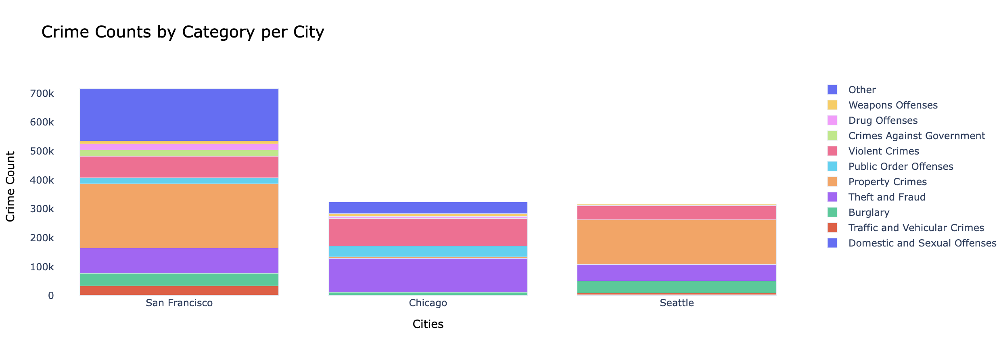
<br>

### 2. **Crime Statistics by Year**  
   A bar chart visualizing the total number of crimes for each year, providing insights into crime trends over time. This visualization helps identify whether crime rates are increasing or decreasing in a given period..

   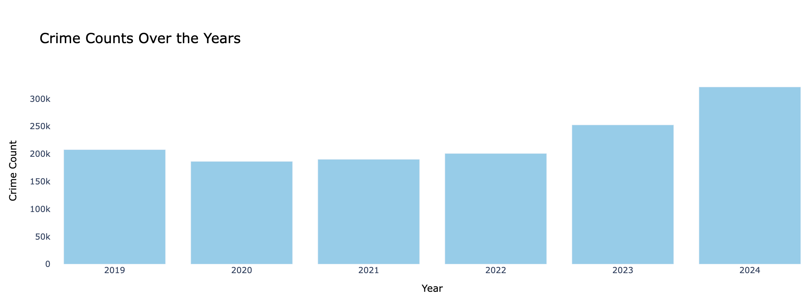
<br>

### 3. **Crime Per Month**  
   A monthly crime trends visualization that tracks how crime counts fluctuate month-to-month. This helps users understand seasonal variations and patterns in criminal activity.

   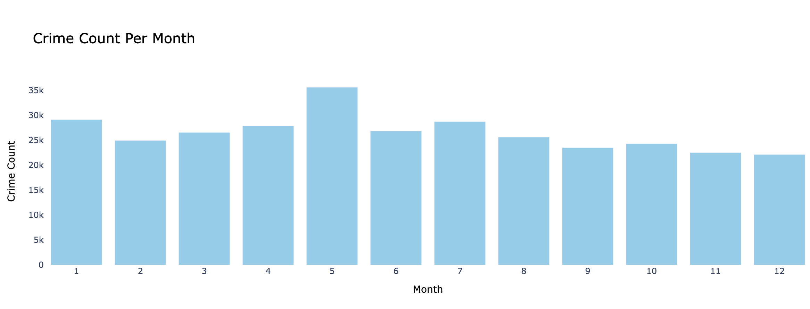
<br>

### 4. **Crime by Date Range**  
   A line chart showing crime data over a specific date range, allowing for a detailed view of crime trends during particular periods. This helps identify spikes or drops in crime over time.

   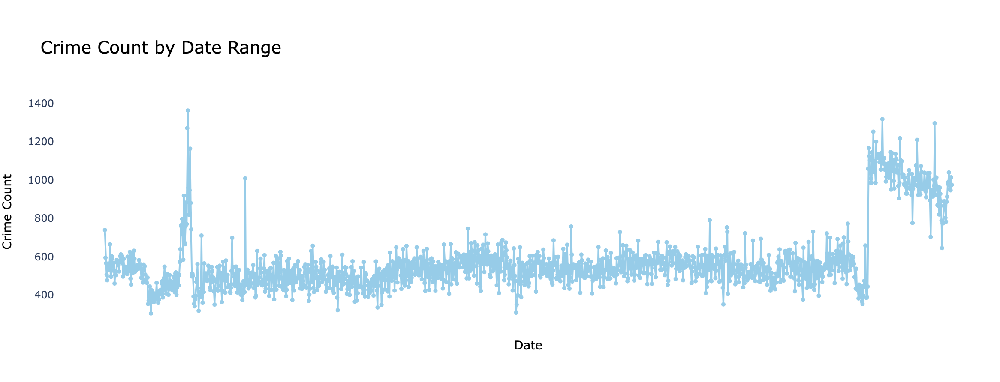
<br>

### 5. **Crime Comparison Per Year**  
   A comparative bar chart illustrating crime trends across multiple years, making it easy to compare how crime counts have changed over time for different cities or categories.

   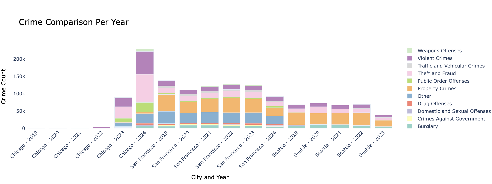
<br>

### 6. **Crime Statistics by Category**  
   A bar chart that displays the number of crimes grouped by their category, such as theft, assault, or burglary. This provides a quick overview of the most common types of crime in the dataset.

   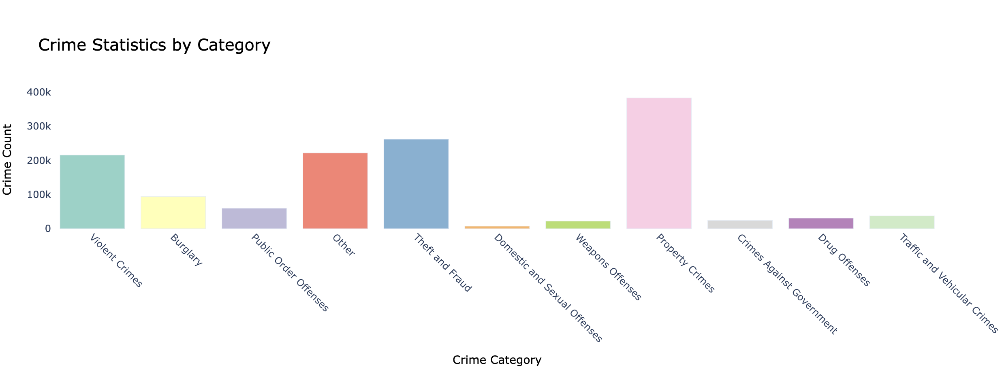
<br>


### 7. **Crime Count by Day of Week**  
   A bar chart that shows the distribution of crimes by the day of the week. This allows users to see if crime activity is higher on certain days, such as weekends or weekdays.

   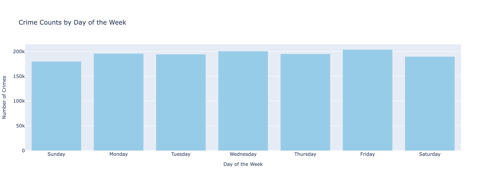
<br>

### 8. **Crime Count by Subcategories for the Theft Category**  
   A bar chart focusing on subcategories within the broader crime category of theft. This breakdown enables deeper insights into specific types of theft, such as car theft or shoplifting.

   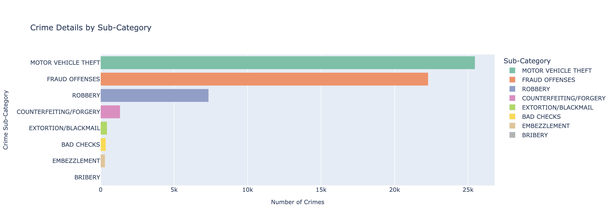
<br>


### 9. **Crime Density by Location**  
   A map visualization of a city, highlighting crime density in the location. This allows users to see crime hotspots and identify areas where law enforcement may need to focus more resources.

   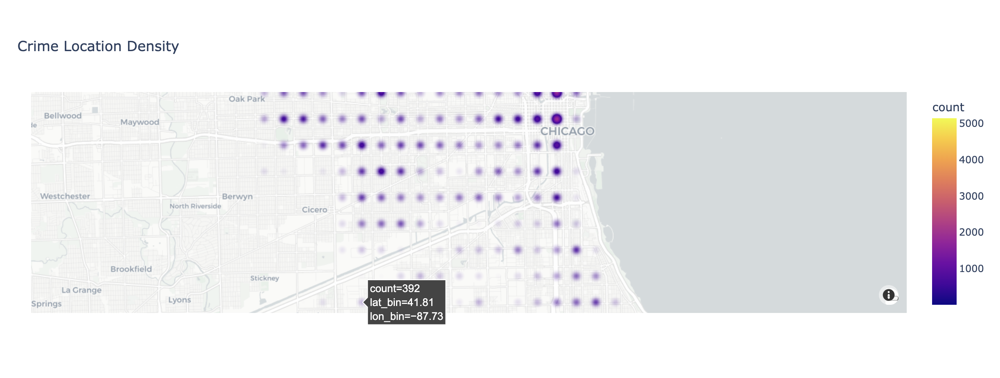
<br>

### 10. **Reverse Geocode of langitude and latitude point to get the exact street address**  
   A map feature that converts latitude and longitude coordinates into a specific street address, helping to pinpoint exact locations where crimes have occurred. This tool is useful for precise location tracking and investigation.

   This feature uses the Nominatim API from OpenStreetMap to convert latitude and longitude coordinates into precise street addresses. By providing the city and sub_category parameters, users can obtain the exact location of a crime incident, such as an assault, within the city.

   External API: Nominatim (OpenStreetMap)
   Nominatim is an open-source geocoding API that translates geographic coordinates into human-readable addresses. It is commonly used for location-based analysis.

   Endpoint: https://nominatim.openstreetmap.org/reverse
   Parameters: lat, lon, format=json, addressdetails=1


   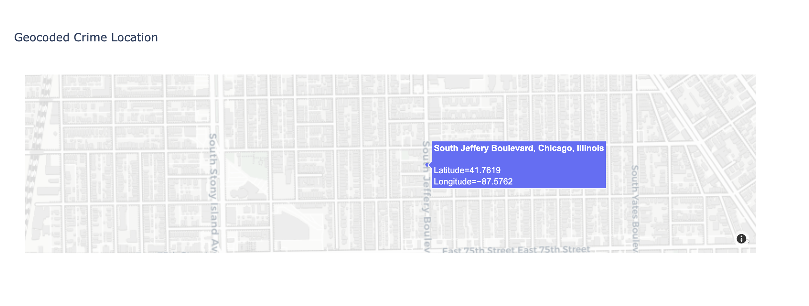
<br>

# Conclusion

The Crime Data API and Visualization Dashboard project provides a comprehensive solution for analyzing and visualizing crime data across various U.S. cities. The API enables users to query crime statistics, trends, and geolocation-based data, while the dashboard offers an intuitive interface for visual exploration of this data. By leveraging powerful tools like Flask, SQL, and modern front-end technologies, the project aims to enhance the understanding of crime patterns and support informed decision-making for city planners, law enforcement, and researchers.

# Future Enhancements

- Enhanced Data Sources: Integrating more cities and potentially adding real-time crime data for dynamic analysis.
- Predictive Analytics: Adding machine learning models to predict future crime trends based on historical data.
- User Customization: Allowing users to create custom reports and visualizations based on their specific needs through a form.
- Mobile Support: Optimizing the dashboard for mobile devices to expand access to the visualization tools.

# Acknowledgements

This project would not have been possible without the support of the open-source community and various publicly available crime data sources. Special thanks to contributors of the libraries and tools used in this project, such as Flask, SQL, Pandas, and the visualization libraries.


# Contact
For any inquiries or contributions, feel free to contact:

Tinovimba Hove

Email: hovetl@clarkson.edu

GitHub: https://github.com/Tinovimba-Hove
